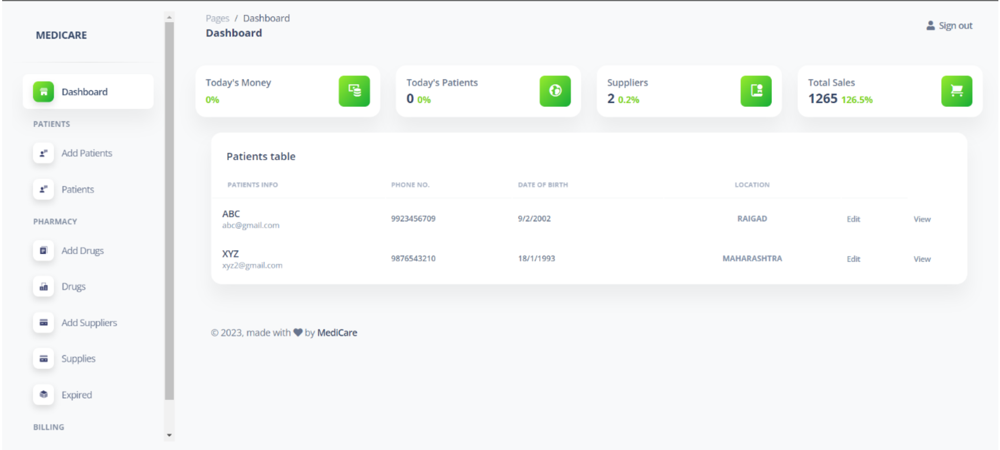
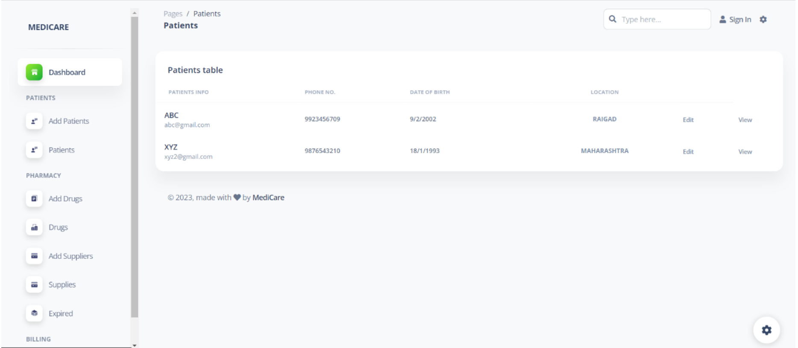

# 💊 MediCare Pharmacy Management System

MediCare is a comprehensive Pharmacy Management System designed to automate various aspects of pharmacy operations, ensuring accuracy, efficiency, and improved service delivery.

## 🎯 Objectives

The primary objectives of implementing the MediCare Pharmacy Management System are:
- **⚙️ Automation of Processes:** Streamlining pharmacy operations through automation of prescription processing, inventory management, and sales transactions.
- **📊 Accurate Record-Keeping:** Ensuring precision in maintaining patient records, medication inventory, and sales data.
- **🚀 Improved Service Delivery:** Enhancing customer experience by reducing waiting times, minimizing errors, and providing timely medication dispensing.

## 📌 Scope

The scope of the MediCare Pharmacy Management System includes:
- **📜 Prescription Management:** Capturing, processing, and storing prescription information securely.
- **📦 Inventory Control:** Real-time monitoring and management of medication stock to prevent shortages or excess.
- **💸 Sales and Billing:** Efficient handling of sales transactions and generation of accurate invoices.
- **🔐 User Access Control:** Implementing user roles and permissions to ensure data security and privacy.
- **📈 Reporting and Analytics:** Providing insights through reports on sales, inventory, and other relevant metrics.

MediCare's system architecture is designed for efficiency and security. It comprises:
- **🎨 Front-end:** User-friendly interface developed using HTML, CSS, and JavaScript for seamless navigation and interaction.
- **🖥️ Back-end:** Robust back-end handling database management with PHP and MySQL.
- **☁️ Cloud-Based Servers:** Ensuring scalability and reliability.
- **🔒 Security Measures:** Incorporating data encryption and secure authentication mechanisms.

## 🛠️ Technology Stack

The MediCare system uses the following technologies:
- **HTML:** For structuring web content.
- **CSS:** For styling and layout.
- **JavaScript:** For dynamic and interactive features.
- **PHP:** For server-side scripting and logic.
- **MySQL:** For database management.

## 🔄 System Flow

1. **User Interaction:** Users interact with the system via the front end.
2. **Frontend to Backend Communication:** The front-end communicates with the backend server using HTTP requests.
3. **Data Processing:** PHP scripts process user input and interact with the MySQL database.
4. **Database Interaction:** Retrieving or updating information related to prescriptions, inventory, sales, and user accounts.
5. **Response Generation:** The backend generates dynamic content and sends it back to the front end.
6. **User Feedback:** Users receive feedback on their actions, such as successful prescription submissions or completed transactions.

## Media

## 🛡️ Security Measures

- **Data Encryption:** Protecting sensitive data during transmission.
- **User Authentication and Authorization:** Ensuring secure access control.
- **Database Security:** Securing the MySQL database with proper authentication and authorization.
- **Regular Backups:** Preventing data loss through regular database backups.

## 📊 Scalability and Future Expansion

The MediCare system is designed with scalability in mind, allowing for easy addition of new features or enhancements. The modular architecture and use of industry-standard technologies ensure compatibility with future updates.

## 🚀 Getting Started

To get started with MediCare, follow these steps:
1. **Clone the repository:** `git clone https://github.com/yourusername/medicare.git`
2. **Install dependencies:** Follow the installation guide in the `docs/INSTALL.md` file.
3. **Setup the database:** Import the provided SQL schema into your MySQL database.
4. **Configure the environment:** Update the configuration files with your database and server details.
5. **Run the application:** Use your preferred server setup to start the MediCare application.

## 📞 Contact

If you have any questions or feedback, please reach out to us at support@medicare.com.

---

Thank you for using MediCare! We hope our system helps you manage your pharmacy operations efficiently. 💙
